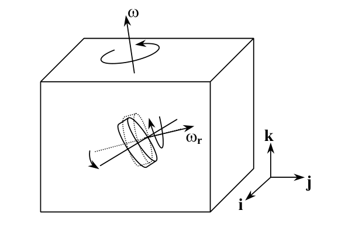
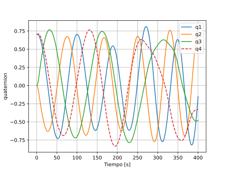
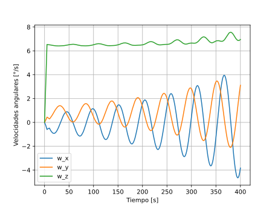
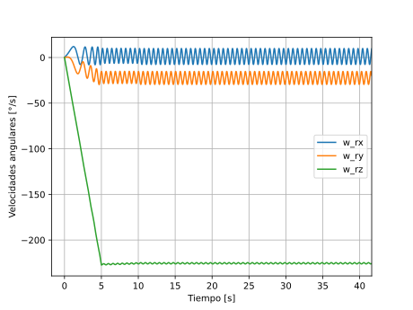

# CubeSat Attitude Determination Control System (Currently Working on it!)
## Progress so far
This is my most recent project, focused on developing the Attitude Determination and Control System (ADCS) for a CubeSat. At this stage, the system is modeled using a Variable-Speed Control Moment Gyroscope (VSCMG) to control the satellite’s orientation.

    

The project is pretty big, so I started with simulations:
- [x] Studied fundamental physics, including Euler's equations and reference frames.
- [x] Performed preliminary simulations to validate the models.
- [ ] Developed initial control system concepts.
- [ ] Conducted simulations including the control systems

The initial simulations are very basic: given the inertia matrix of the rotor and spacecraft, along with a prescribed torque profile, the goal is to simulate the CubeSat’s orientation starting from zero angular velocity. Here are some of the results, and you can check some of the theory [here](docs/theory/theory.md) and the main python code [here](src/ex_13_5.py):

  
  
  **Fig 1. CubeSat orientation**

    
  
  **Fig 2. Angular velocity of the CubeSat**

  
  
  **Fig 3. Rotors velocity**

