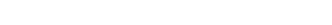

# Kinematics & Dynamics

## Dynamics
The main principle behind reaction wheels is the **conservation of angular momentum**, which is the sum of the satellite's angular momentum and the rotors' angular momentum, as shown below.

  

Since there are no external torques, we can set the derivative of the total angular momentum to zero:

We can then rearrange the equation to:

And its explicit component-wise form is:

  

