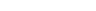
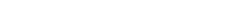

# Kinematics & Dynamics

## Dynamics
The main principle behind reaction wheels is the **conservation of angular momentum**, which is the sum of the satellite's angular momentum and the rotors' angular momentum, as shown below.

  

Since there are no external torques, we can set the derivative of the total angular momentum to zero:

  

We can then rearrange the equation to: 

  

S(ω)[1](#footnote1)

And its explicit component-wise form is:

  

## Kynematics

There are many ways to represent the attitude of the spacecraft, such as Euler Angles, Rodrigues Parameters, quaternions, etc. For this application, we'll focus on the nonsingular quaternion representation, defined as:

  

Here, \(c_{ij}\) denotes the elements of the rotation matrix, constructed using a **3-1-3 Euler rotation sequence**:

  

And the attitude kinematics of the spacecraft, expressed in terms of the quaternion, are given by:

  

Ω[2](#footnote2)

---

<a name="footnote1">[1]</a> **Skew-Symmetric Matrix**:  
S(ω) is the skew-symmetric matrix associated with the angular velocity vector ω, defined as:

  

<a name="footnote2">[2]</a> **Skew-Symmetric Matrix**:  
Ω is the skew-symmetric matrix associated with the angular velocity vector ω, defined as:

  

